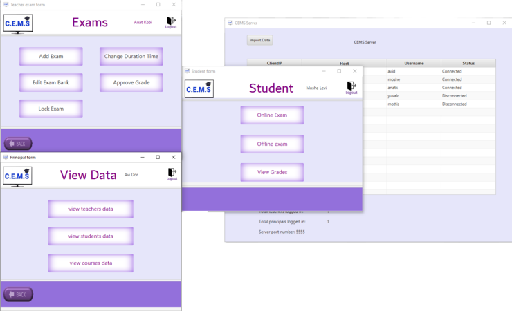
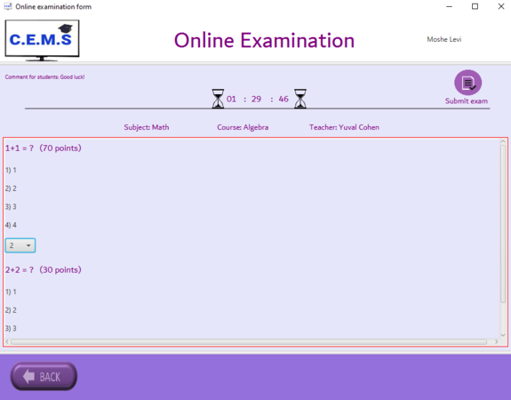
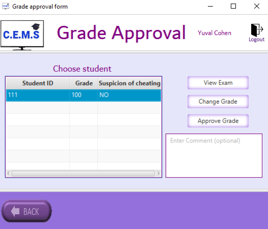

# CEMS System

### Table of contents
* [General info](#general-info)
* [Technologies](#technologies)
* [Setup](#setup)
* [Example run](#example-run)

#### General Info
CEMS is a project which my group and I worked on through the semester. The system has many unique features, depending on the logged in user type - 
Students can perform "online" exams, which are done using the system (including a timer, lock exam option, give extra time with certain criteria, etc.), "offline" exams which require the student to download them, view grades and more. 
Teachers can create new questions and exams, edit existing questions and exams, approve or change grade of students exams, etc. 
Principal can view statistics from the system's DB, whether it is for a specific course or teacher, approve extra time for exam, etc. 

 I got a better understanding of many related material during this project, among them:
- Creating UML diagrams using Visual Paradigm - Use-Case Diagrams, Class Diagrams, Sequence Diagrams and Activity Diagrams.
- Implementing DB to the system (written in Java using Eclipse IDE) using MySQL.
- Multithreading - used for functions related to timer.
- Client\Server (TCP\IP)
- Proper code documentation
- Unit testing

#### Technologies
* JAVA SE Platform 15 (JDK 15.0.1)
* JAVAFX SDK
* JUnit 5
* Eclipse IDE

#### Setup
All necessary library files to run the project are included.

#### Example run
  
  
  
 
 
